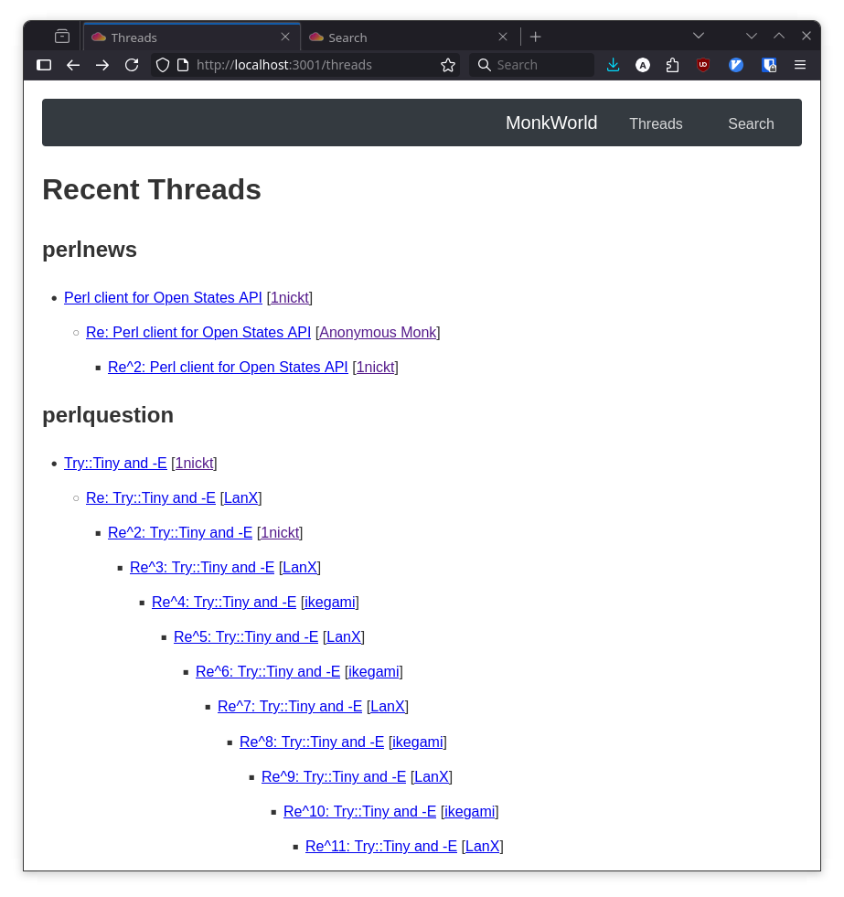
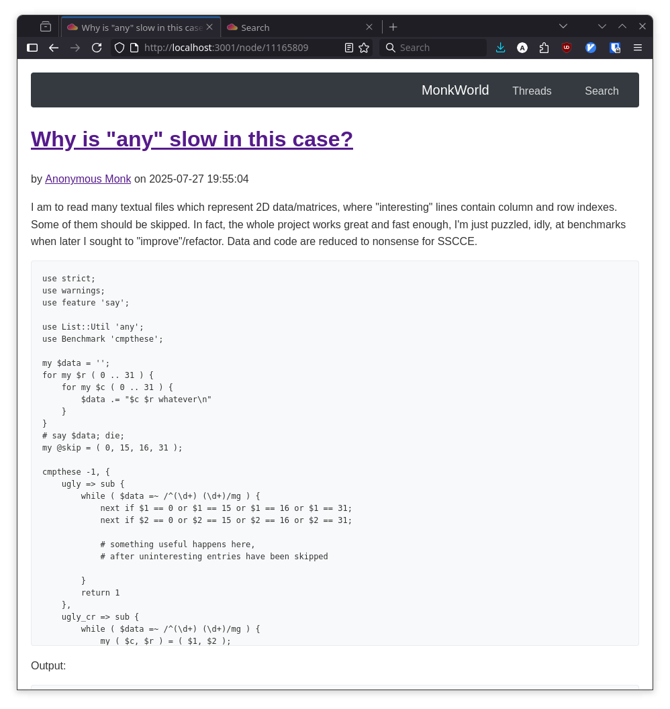

# MonkWorld

A proof of concept for rewriting PerlMonks using modern Perl technologies.

It is split into two parts:

- This project, the front end that users interact with.
- The back end (see [monk_world_api](https://github.com/arunbear/monk_world_api)), which is a REST API that provides data to the front end.

## Requirements

- Perl 5.42.0 or higher
- Required Perl modules (see `cpanfile`)

## Local Development

1. Clone the repository:
   ```bash
   git clone <repository-url>
   cd monk_world
   ```

2. Install dependencies using `cpanm`:
   ```bash
   cpanm --installdeps .
   ```
## Running Tests

Note: the API stub needs to be running. You'll need two terminals:

Terminal 1 - Start the API stub:
```bash
./script/api_stub daemon -l "http://*:3000"
```

Terminal 2 - Run the tests:
```bash
# Using prove (recommended)
prove -l
```

## Screenshots

### Home Page


The main page displays recent threads organized by sections.

### Search Interface


The search page allows users to query Perl Monks content.

### Node View


This shows an individual user post.
